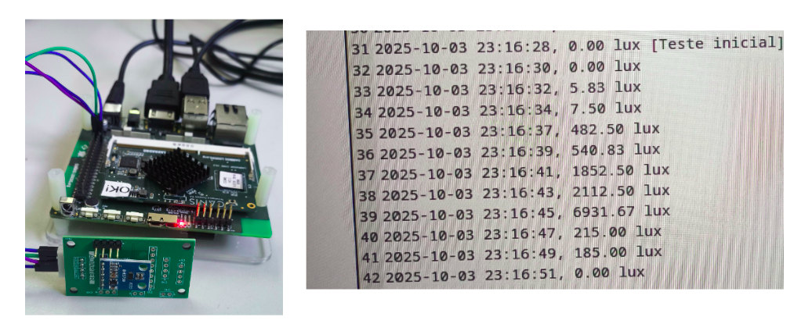

# Labrador32 LuxLogger

<p align="center">
    
</p>


Sistema de logging com sensor de luminosidade BH1750 para a placa Labrador32, desenvolvido para monitoramento contínuo de luz ambiente.

# 1) Arquitetura

```
Labrador32_luxlogger/
├── logger.py              # Script principal
├── modules/
│   ├── luxlogger.py       # Classe principal do sistema
│   ├── bht1750.py         # Configuração do sensor BH1750
│   └── sdcard.py          # Gerenciador do Cartão SD
└── README.md
```

# 2) Como utilizar o Projeto

## 2.1 Requisitos de Hardware

- [**Placa Labrador32**](https://caninosloucos.org/en/labrador-32-en/)
- **Sensor BH1750** 
- **Cartão SD**  de, no máximo, 32 GB (Limite do Labrador)

Conecte o sensor BH1750 aos pinos I2C da Labrador32:

| Pino do Sensor | Conexão na Labrador32 |
|----------------|----------------------|
| **VCC**        | 3.3V  (Pino 1)               |
| **GND**        | GND  (Pino 6)                |
| **SDA**        | SDA (Pino 3)     |
| **SCL**        | SCL (Pino 5)       |

### Imagem com as conexões

<p align="center">
    
</p>


## 2.2 Requisitos de Software

- **Python 3.6+** (recomendado Python 3.8 ou superior)
    > Essencial para executar o arquivo do projeto.
- **Ambiente virtual Python**
    > Isso é necessário porque o sistema operacional impede a instalação de pacotes Python de forma global para evitar que o sistema seja danificado.
- **python-periphery**
    > Biblioteca a para comunicação I2C com o sensor.

### Instalação das Dependências

1. **Criar ambiente virtual:**
    ```bash
    # Criar ambiente virtual
    python3 -m venv venv

    # Ativar ambiente virtual
    source venv/bin/activate
    ```
    > Com o `venv`, criamos um espaço isolado onde você pode instalar as bibliotecas sem afetar o sistema principal.

2. **Instalar dependências:**
    ```bash
    # Instalar python-periphery
    pip3 install python-periphery
    ```

3. **Configurar permissões I2C no Labrador32:**
    ```bash
    chown caninos /dev/i2c-2
    chmod g+rw /dev/i2c-2
    ```

### Execução
Para executar o projeto, utilize o comando abaixo:

```bash
python3 logger.py
```

# Considerações Importantes

- **Pinagem**: A pinagem apresentada é apenas uma sugestão. Você pode alterar os pinos conforme sua necessidade, desde que mantenha as conexões I2C (SDA e SCL) corretas.

- **Caminho do Cartão SD**: O caminho do cartão SD pode ser diferente dependendo do ponto de montagem no seu Labrador32. O caminho padrão configurado é `storage_path='/media/caninos/DADOS_SD'`, mas você pode precisar ajustar este caminho se o cartão for montado em um local diferente. Para verificar o ponto de montagem do seu cartão SD, use o comando:
  ```bash
  df -h
  ```